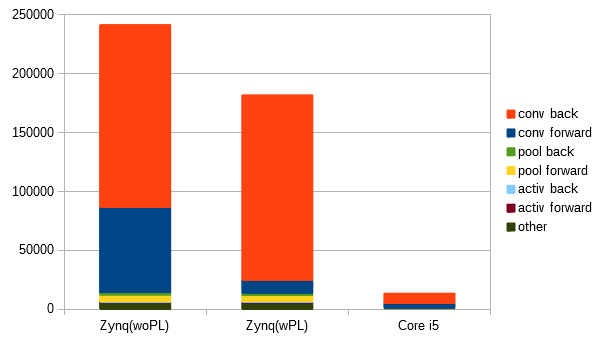

# tiny-dnn を FPGA で実行する

オリジナルの [tiny-dnn のリポジトリ](https://github.com/tiny-dnn/tiny-dnn)

課題は ```examples/mnist``` を軽量化して実験中です。

## CPU だけで実行する

[このコミット](https://github.com/tom01h/tiny-dnn/tree/fa7d77bf524b4604d6088ae5a944193f1c2464af)を使う

### WSL 上で実行するには
ホストPCの ```examples/mnist``` 以下で

```
$ g++ -pthread -Wall -Wpedantic -Wno-narrowing -Wno-deprecated -O3 -DNDEBUG -std=gnu++14 -I ../../ -DDNN_USE_IMAGE_API train.cpp -o train
$ ./train --data_path ../../data/ --learning_rate 1 --epochs 1 --minibatch_size 16 --backend_type internal
```

### Zynq 上で実行するには
ホストPCの ```examples/mnist``` 以下でクロスコンパイルして
```
$ arm-linux-gnueabi-g++ -O3 -mfpu=neon -mtune=cortex-a9 -mcpu=cortex-a9 -mfloat-abi=softfp -Wall -Wpedantic -Wno-narrowing -Wno-deprecated -DNDEBUG -std=gnu++14 -I ../../ -DDNN_USE_IMAGE_API train.cpp -o train -static
```

SD カードに ```train, data/``` をコピーして Zynq の Linux 上で
```
root@Cora-Z7-07S:~# mount /dev/mmcblk0p1 /mnt/
root@Cora-Z7-07S:~# /mnt/train --data_path /mnt/data/ --learning_rate 1 --epochs 1 --minibatch_size 16 --backend_type internal
```

## アクセラレータ実装中
畳み込みの行列乗算を 16MAC で並列に計算して学習を加速します。  
順方向伝搬と逆方向の傾き伝搬部分に対応しています。  
ウェイトの傾き計算は対応中です。  

説明は ```examples/mnist/readme.md``` に整備中です。

このくらい高速になります。  
