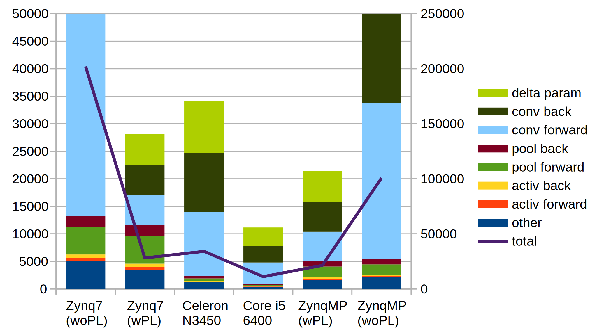

# tiny-dnn を FPGA で実行する

オリジナルの [tiny-dnn のリポジトリ](https://github.com/tiny-dnn/tiny-dnn)

課題は ```examples/mnist``` を軽量化して実験中です。

## CPU だけで実行する

[このコミット](https://github.com/tom01h/tiny-dnn/tree/fa7d77bf524b4604d6088ae5a944193f1c2464af)を使う

### WSL 上で実行するには
ホストPCの ```examples/mnist``` 以下で

```
$ g++ -pthread -Wall -Wpedantic -Wno-narrowing -Wno-deprecated -O3 -DNDEBUG -std=gnu++14 -I ../../ -DDNN_USE_IMAGE_API train.cpp -o train
$ ./train --data_path ../../data/ --learning_rate 1 --epochs 1 --minibatch_size 16 --backend_type internal
```

### Zynq 上で実行するには
ホストPCの ```examples/mnist``` 以下でクロスコンパイルして
```
$ ${SDK path}/gnu/aarch32/nt/gcc-arm-linux-gnueabi/bin/arm-linux-gnueabihf-g++.exe -O3 -mfpu=neon -mtune=cortex-a9 -mcpu=cortex-a9 -mfloat-abi=hard -Wall -Wpedantic -Wno-narrowing -Wno-deprecated -DNDEBUG -std=gnu++14 -I ../../ -DDNN_USE_IMAGE_API train.cpp -o train
```

SD カードに ```train, data/``` をコピーして Zynq の Linux 上で
```
root@Cora-Z7-07S:~# mount /dev/mmcblk0p1 /mnt/
root@Cora-Z7-07S:~# /mnt/train --data_path /mnt/data/ --learning_rate 1 --epochs 1 --minibatch_size 16 --backend_type internal
```
#### ZynqMP の場合は
コンパイルコマンドを以下に変更
```
$ ${SDK path}/gnu/aarch64/nt/aarch64-linux/bin/aarch64-linux-gnu-g++.exe -O3 -mtune=cortex-a53 -mcpu=cortex-a53 -Wall -Wpedantic -Wno-narrowing -Wno-deprecated -DNDEBUG -std=gnu++14 -I ../../ -DDNN_USE_IMAGE_API train.cpp -o train
```

## アクセラレータ実装中

畳み込みの行列乗算を 16MAC で並列に計算して学習を加速します。  
説明は ```examples/mnist/readme.md``` に整備中です。

このくらい高速になります。  
ただし、入力データの傾きを求める計算をスキップする変更をソフトウェアに入れています。



### 残件

- AXI-Stream マスタは最後の転送で LAST を出す
- バス幅を広げる
- 転送と演算と並列実行する
  - (済) ユーザ空間 ⇔ DMA バッファ間の転送
  - DMA バッファ ⇔ IP 内バッファの転送
  - 演算コア → IP 内バッファの転送
- (済) udmabuf を使ってみる
- ZynqMP で IOMMU(SMMU) を使ってみる
