# 誤差逆伝搬の計算方法

ハードウェアに計算させるなら、順方向だろうが逆方向だろうが同じような手順で計算させたいですよね。  
ここでは、tiny-dnn アクセラレータで使っている誤差逆伝搬の計算方法を紹介します。  
あまりちゃんと調べずに自分で考えた方法なのですが、これって実はよく知られた方法ですかね？

padding に関してもちょっとだけあるのですが今は置いておくとして…

ウェイトデータを工夫すれば、順方向の畳み込みと同じような計算で逆方向の誤差伝搬を計算できます。  
下の絵を見ればわかると思いますが、

1. カーネル内のデータを逆順にする
2. 入力チャネルと出力チャネルをシャッフルする

たんに計算順を変えただけなので説明不要ですよね。  
ちなみに、stride!=1 の事は考えていません。

