# tiny-dnn アクセラレータコア

## データ型

tiny-dnn アクセラレータの入出力データ型は 32bit Float 型です。  
ただし、入力データは下位 16bit が切り捨てられて bfloat16 型に変換されます。  
また、連続した積和演算の途中のデータは独自のデータ型を使います。  
独自データ型は符号、指数部、仮数部を結合せずそれぞれ値を保持します。  
符号、指数部はそれぞれ 1bit と 8bit で 32bit Float 型と同じですが、仮数部は正規化前の 33bit のデータを保持します。  
積和演算結果は次の積和演算の加数として入力され、乗算結果との指数差に合わせて再度アラインメントされるため、正規化前の値をフィードバックしています。  
アクセラレータコアから取り出したデータは 32bit Float 型に変換されます。

## 構成

アクセラレータコアの構成は、次のような4段パイプ構成です。  
全体的に、丸めは省略して切り捨てにしています。

#### 1サイクル目

ソースデータとウェイトの読み出しをします。  
共に bfloat16 型です。  
ソースデータはコアの外にあり、すべてのコアで共通の値を使います。  
ウェイトはコアごとに別々の値です。

#### 2サイクル目

積和演算です。  
指数を比較して、加数が十分に小さいときはアラインメント出力を 0 にします。  
乗算結果が十分に小さいときは積和演算結果を更新しません。  
指数差が適度な場合は前回の積和演算結果をアラインしますが、アラインメントシフトでオーバーフローが発生した時も積和演算結果を更新しません。  
この処理は、中間データを正規化せずにフィートバックしているために必要になります。  
すべての条件に当てはまらない場合だけ、積和演算結果を使います。

#### 3,4サイクル目

正規化をして 32bit Float 型に変換します。  
正規化回路はコア外に 1個しかありません。