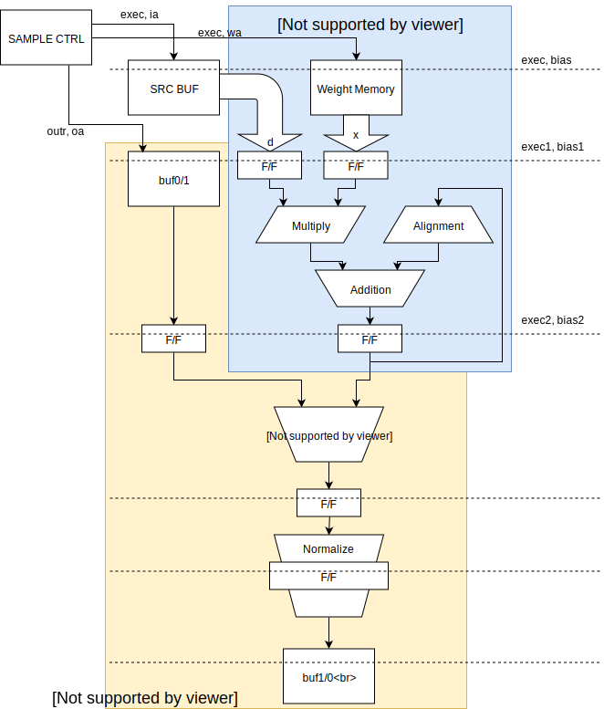

# tiny-dnn アクセラレータコア

## データ型

tiny-dnn アクセラレータの入出力データ型は 32bit Float 型です。  
ただし、入力データは下位 16bit が切り捨てられて bfloat16 型に変換されます。  
アクセラレータコアが扱う入力データは bfloat16 型です。  
また、連続した積和演算の途中のデータは独自のデータ型を使います。  
独自データ型は符号、指数部、仮数部を結合せずそれぞれ値を保持します。  
符号、指数部はそれぞれ 1bit と 8bit で 32bit Float 型と同じですが、仮数部は正規化前の 32bit のデータを保持します。

## 機能

何語だかわからない言語で大雑把に書くと下のような機能のコアを16個持ちます。

```
module tiny_dnn_core
  (
   input wire                init,
   input wire                exec,
   input integer             a,
   input bfloat16            d,
   output custom_float_type  x
   );
   bfloat16         W [0:f_size-1];
   bfloat16         Wl;
   always@(*)begin
      if(init)begin
         x = 0;
      end else if(exec)begin
         Wl = W[a];
         x = x + Wl * d;
      end
   end
endmodule
```

またしても何語だかわかりませんが、16個のコアを使って ```size``` サイクルで以下の計算をします。

```
for(i=0; i<size; i++){
	# parallel for
	for(oc=0; oc<16; oc++){
        x[oc] += W[oc][i]*d[i];
    }
}
```

実際は畳み込み層の計算をするので、Wとdのアドレスは単純なインクリメントではありませんが、そこは ```sample_controller``` の仕事です。

1サイクルピッチで ```custom_float_type``` に積和の結果を累積するために、```custom_float_type``` 型では加数部の正規化を行いません。  
積和演算結果は次の積和演算の加数として入力されるため、正規化前の結果を乗算結果との指数差に合わせてアラインメントして加算します。  
アクセラレータコアから取り出したデータは ```normalize``` モジュールで32bit Float 型に変換されます。

## 構成

アクセラレータコアの構成は、次のような5段パイプ構成です。  
全体的に、丸めは省略して切り捨てにしています。  
ΔW をミニバッチ内の全 sample 分だけ累積するため、```dst_buf``` 内に加算器を持ちます。



#### 1サイクル目

ソースデータとウェイトの読み出しをします。  
共に bfloat16 型です。  
ソースデータはコアの外にあり、すべてのコアで共通の値を使います。  
ウェイトはコアごとに別々の値です。

#### 2サイクル目

積和演算です。  
指数を比較して、加数が十分に小さいときはアラインメント出力を 0 にします。  
乗算結果の指数が加数の指数よりも十分に小さいときは積和演算結果を更新しません。  
指数差が適度な場合は前回の積和演算結果をアラインしますが、アラインメントシフトでオーバーフローが発生した時も積和演算結果を更新しません。  
加数が正規化されている場合は指数の比較だけで十分ですが、中間データを正規化せずにフィートバックしているためにこの処理が必要になります。  
すべての条件に当てはまらない場合だけ、積和演算結果を使います。

#### 4,5サイクル目

正規化をして 32bit Float 型に変換します。  
正規化回路はコア外に 1個しかありません。

#### 2サイクル目 (ΔWのみ)

ΔW を累積するために、前回までの累積値を読み出します。

#### 3サイクル目 (ΔWのみ)

ΔW を累積します。