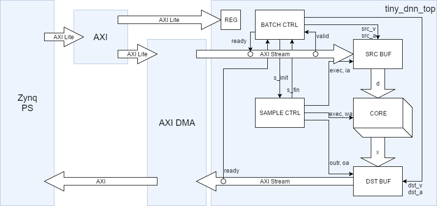

# tyny-dnn アクセラレータ作成中

## 概要

AXI Stream で 1サンプル分のデータを受け取り、core で畳み込み計算をして、AXI Stream で 1サンプル分の結果を吐き出します。  
source buffer と destination buffer に 1サンプル分の入出力データを置くためのバッファを持ちます。  
ウェイト用のバッファは core 内に持ちます。  
sample controller で 1サンプル内の制御をして、batch controller でミニバッチ 1層の制御をします。  
今はまだ、順方向伝搬だけしか対応していません。  



## もう少し細かく

### sample controller
batch controller からリクエストを受けて
1. カーネルごとに
  - 入力データのアドレス(ia)を生成して入力データ(d)を取ってくる
  - core にウェイトのアドレス(wa)と入力データ(d)を渡して計算する
2. 1カーネル分の計算が終わると出力データ(x)のアドレス(oa)を生成してデータを吐き出す
3. 終わったらストライド分(1限定だけど)だけ移動して、1サンプルの計算が終わるまで繰り返す

1サンプルの計算が終わると batch controller に知らせます。

### batch controller
CPU からリクエストを受けて
1. 入力側の AXI Stream の ready を上げて 1サンプル分のデータを受け取る
2. 入力側の AXI Stream の ready を下げて DMA を中断
3. sample controller にリクエストを投げて計算開始
4. sample controller から計算終了の通知を受けると 出力側の AXI Stream の valid を上げる
5. 1サンプル分のデータを出力したら valid をさげて、ミニバッチ分だけ繰り返す

ミニバッチが終わると CPU に制御を戻します。  
tini_dnn アクセラレータの設定はミニバッチごとに 1回ですが、DMA の設定は 1sample ごとに設定しなおします。

### core
畳み込みの計算をしますが、この説明は別の機会に…

## 検証環境
Verilator とコラボした協調検証環境(全部手彫り)です。  
すごく遅いですが、次のコマンドを打つと動きます。

[sim_lv1 ブランチ](https://github.com/tom01h/tiny-dnn/tree/sim_lv1) は FPU が偽物で、比較的高速なシミュレーションができます。  
master ブランチは FPU が本物なので、シミュレーションが遅いです。

```
$ make
$ sim/Vtiny_dnn_top --data_path ../../data/ --learning_rate 1 --epochs 1 --minibatch_size 16 --backend_type internal
```

この環境の本体は tiny_dnn です。グローバル変数に Verilator のオブジェクト？を割り当てます。  
FPGA で動かす時に PL にオフロードするところで Verilator のオブジェクト？に値を設定して、クロックと時間を進めて評価します。  
PL にオフロードするところだけを RTL シミュレーションできるのでそこそこ高速です。  
FPGA にもっていくときは、同じところを PL を操作するように書き換えます。

## FPGA で動かすには

### ブロックデザインを作る

1. Vivado で tiny_dnn アクセラレータのファイル （```CORA/tiny_dnn_top.v, tiny_dnn_reg.v``` と ```examples/mnist/tiny_dnn_buf.sv, tiny_dnn_control.sv, tiny_dnn_core.sv``` ）を開く
2. ブロックデザインの中に ```tiny_dnn_top``` を RTLモジュールとして追加する
3. ほかの部品を ```design_1.pdf``` を参考に追加して結線する
4. PL のクロックは 100MHz (METしないけど…)
5. アドレスマップは下記参照

| master | slave module         | Start Address | End Address |
|--------|----------------------|---------------|-------------|
| PS7    | tiny_dnn Accelerator | 4000_0000     | 4000_FFFF   |
|        | AXI DMA              | 4040_0000     | 4040_FFFF   |
| DMA    | DDR                  | 1C00_0000     | 1FFF_FFFF   |

### Petalinux を作る

#### 暫定版
DMA の Petalinux がうまく作れないので…  
Vivado で Zynq PS と 2つのブロックRAM とつないでビットストリームを作る。  
ブロックRAMは ```0x40000000-0x4000ffff``` と ```0x40400000-0x4040ffff``` にマップする。  
PL のクロックは 100MHz に設定する。  
Vivado でビットストリーム込みの hdf ファイルをエクスポート、```peta/project_1.sdk```にコピーして、

```
$ source /opt/pkg/petalinux/settings.sh
$ cd peta
$ petalinux-create --type project --template zynq --name tiny-dnn
$ cd tiny-dnn/
$ petalinux-config --get-hw-description=../project_1.sdk
```
DMA 転送用のバッファ (0x1c000000-0x1fffffff) を確保して Linux が使わないようにする。  
具体的には ```CORA/system-user.dtsi``` で ```project-spec/meta-user/recipes-bsp/device-tree/files/system-user.dtsi``` を上書きして、

```
$ petalinux-build
```

bit ファイルは tiny_dnn アクセラレータの入った本物をコピーしてきて使う。

```
$ petalinux-package --boot --force --fsbl images/linux/zynq_fsbl.elf --fpga ../design1_wrapper.bit --u-boot
```

生成物は ```images/linux/BOOT.bin, image.ub``` です。

### プログラムをコンパイルする

FPGA で実行するプログラムをコンパイルするときは、```CORA/conv2d_op_internal.h, train.cpp``` で ```tiny_dnn/core/kernels/, examples/mnist/``` を上書きします。    
その後、ホストPCでクロスコンパイルして
```
$ arm-linux-gnueabi-g++ -O3 -mfpu=neon -mtune=cortex-a9 -mcpu=cortex-a9 -mfloat-abi=softfp -Wall -Wpedantic -Wno-narrowing -Wno-deprecated -DNDEBUG -std=gnu++14 -I ../../ -DDNN_USE_IMAGE_API train.cpp -o train -static
```

### 実行する

Petalinux ファイル ```images/linux/BOOT.bin, image.ub``` と、コンパイル済みのソフトと入力データ ```train, data/``` を SD カードにコピーして Zynq をブートします。  
ブート後、Zynq の Linux 上で

```
root@tiny-dnn:~# mount /dev/mmcblk0p1 /mnt/
root@tiny-dnn:~# /mnt/train --data_path /mnt/data/ --learning_rate 1 --epochs 1 --minibatch_size 16 --backend_type internal
```

## 使っている NN モデル
こんな感じ。  


PC で学習させると12秒くらいで終わります。  
学習データも20000に削っています。
```
nn << conv(28, 28, 5, 1, 6, padding::valid, true, 1, 1, backend_type)
   << max_pool(24, 24, 6, 2)
   << relu()
   << conv(12, 12, 5, 6, 16, padding::valid, true, 1, 1, backend_type)
   << max_pool(8, 8, 16, 2)
   << relu()
   << conv(4, 4, 4, 16, 10, padding::valid, true, 1, 1, backend_type)
   << softmax(10);
```
